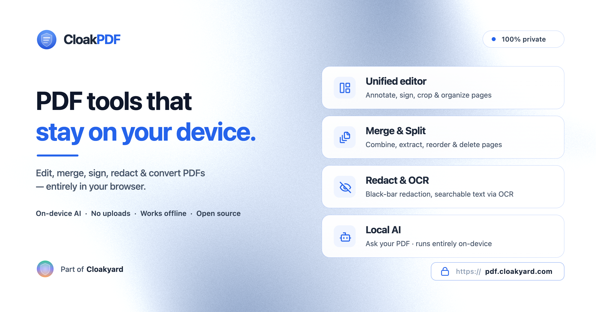
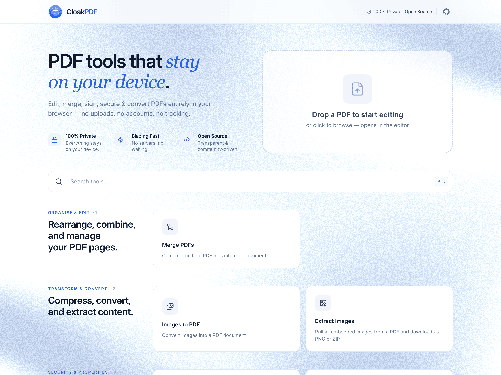

<div align="center">

  

  <p><strong>A fast, private PDF toolkit that runs entirely in your browser.</strong></p>
  <p>No uploads, no servers, no tracking — your files never leave your device.</p>

  <p><a href="https://pdf.cloakyard.com/">pdf.cloakyard.com</a></p>

  <p>
    <a href="https://opensource.org/licenses/MIT"></a>
    
    <a href="https://securityscorecards.dev/viewer/?uri=github.com/cloakyard/cloakpdf"></a>
  </p>

</div>

<p align="center">
  
</p>

---

## ✨ What it does

Drop a PDF and it opens in a single, canvas-based **editor** — a Photoshop-like workspace for one document at a time:

- **✏️ Annotate & sign** — draw, highlight, shapes, text, signatures, fill & flatten forms
- **📄 Pages** — reorder, rotate, delete, crop, N-up, OCR, plus split / extract / contact-sheet on export
- **🔒 Privacy** — redact (burned into the page), find & box text, scrub hidden data, edit or strip metadata
- **🏷️ Stamps & numbering** — watermarks, page numbers, headers & footers, Bates numbering, bookmarks

Export to PDF, images (ZIP), a contact sheet, or split pages — with optional compress / grayscale / flatten / repair / strip-metadata.

A few **standalone tools** cover the jobs the single-PDF editor can't — these mirror the categories on the home screen:

- **🧩 Combine & Convert** — merge PDFs, build a PDF from images, or extract embedded images
- **🔑 Secure & Sign** — add a password & permissions, sign with a certificate, or compare two PDFs
- **🤖 On-device AI** — _Ask your PDF_: chat with a document using a small model that runs entirely in your browser, no API key or server

---

## 🛡️ Privacy first

Everything runs client-side — there is no server to upload to. No accounts, no analytics, no tracking. It's an installable PWA that keeps working offline once loaded, and the on-device AI needs no API key or inference server.

---

## 🧰 Tech stack

| Area             | Technology                                                                                                                   |
| ---------------- | ---------------------------------------------------------------------------------------------------------------------------- |
| Framework        | [React 19](https://react.dev/) + [TypeScript 6](https://www.typescriptlang.org/)                                             |
| Styling          | [Tailwind CSS 4](https://tailwindcss.com/)                                                                                   |
| Build & tooling  | [Vite+ (`vp`)](https://viteplus.dev/)                                                                                        |
| PDF manipulation | [@pdfme/pdf-lib](https://github.com/pdfme/pdf-lib)                                                                           |
| PDF rendering    | [PDF.js](https://mozilla.github.io/pdf.js/)                                                                                  |
| Layout-aware OCR | [LlamaIndex LiteParse](https://www.llamaindex.ai/liteparse) + [Tesseract.js](https://tesseract.projectnaptha.com/)           |
| On-device AI     | [Transformers.js](https://github.com/huggingface/transformers.js) + [LangGraph](https://langchain-ai.github.io/langgraphjs/) |
| Deployment       | [Cloudflare Workers](https://workers.cloudflare.com/)                                                                        |

---

## 🚀 Getting started

```bash
git clone https://github.com/cloakyard/cloakpdf.git
cd cloakpdf
vp install   # needs Node ≥ 24 and `npm i -g vite-plus`
vp dev       # http://localhost:5173
```

| Command    | Description                   |
| ---------- | ----------------------------- |
| `vp dev`   | Dev server with hot reload    |
| `vp build` | Type-check + production build |
| `vp check` | Format, lint, type-check      |
| `vp test`  | Run unit tests                |

---

## 🤖 On-device AI

**Ask your PDF** runs a full retrieval-augmented Q&A pipeline in the browser — the model weights download once from Hugging Face, cache, and work offline after. For the architecture (LangGraph state machine, hybrid retrieval, model choices), see **[docs/local-ai.md](docs/local-ai.md)**.

---

## 🤝 Contributing & license

Contributions are welcome — see [CONTRIBUTING.md](CONTRIBUTING.md). Licensed under the [MIT License](LICENSE).

<p align="center">Built with ❤️ by <a href="https://github.com/sumitsahoo">Sumit Sahoo</a></p>
